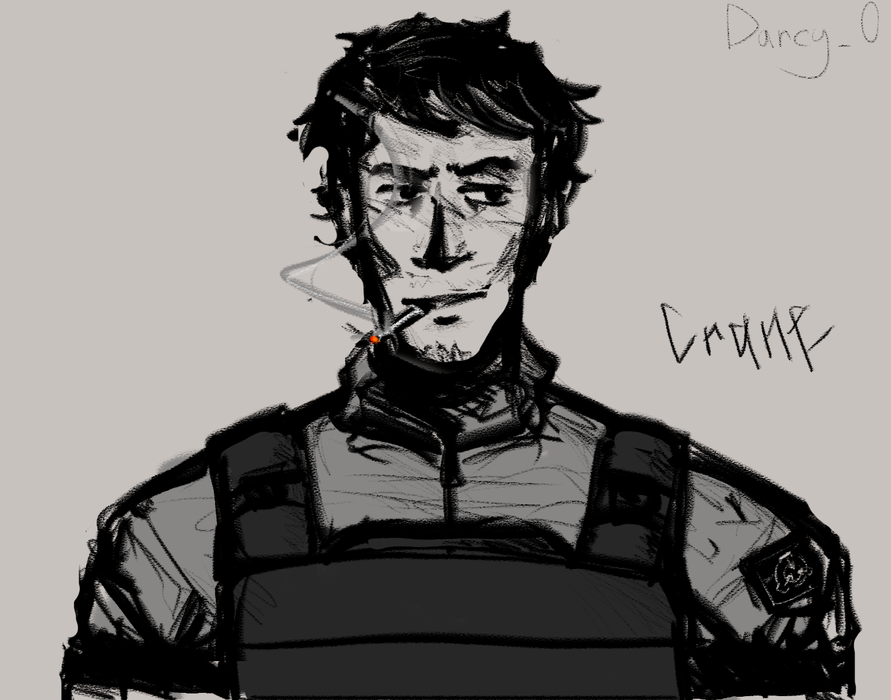
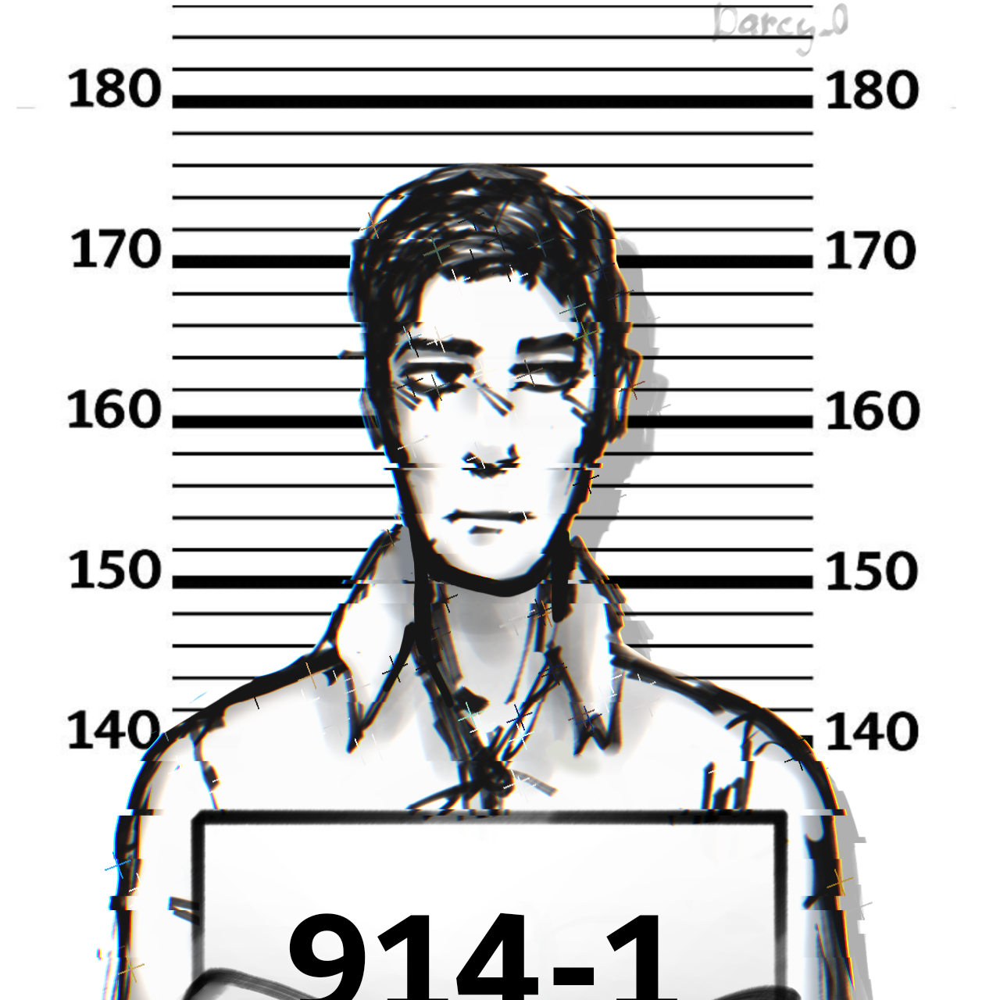
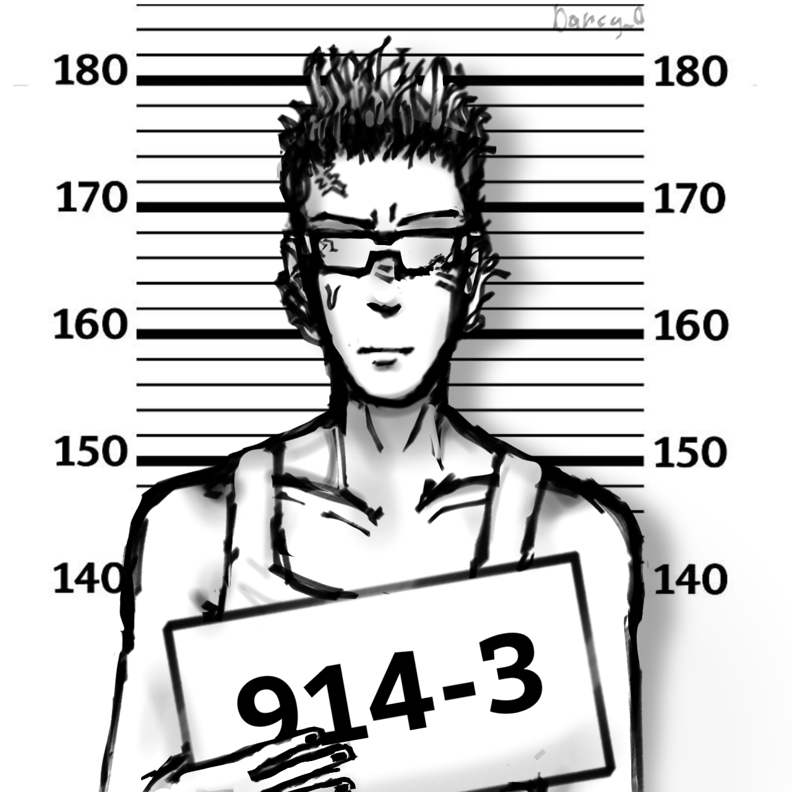
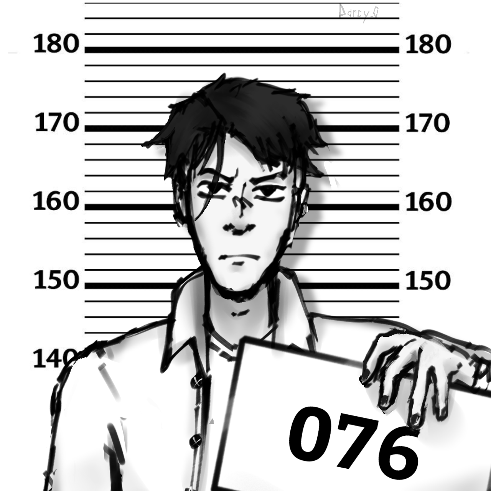
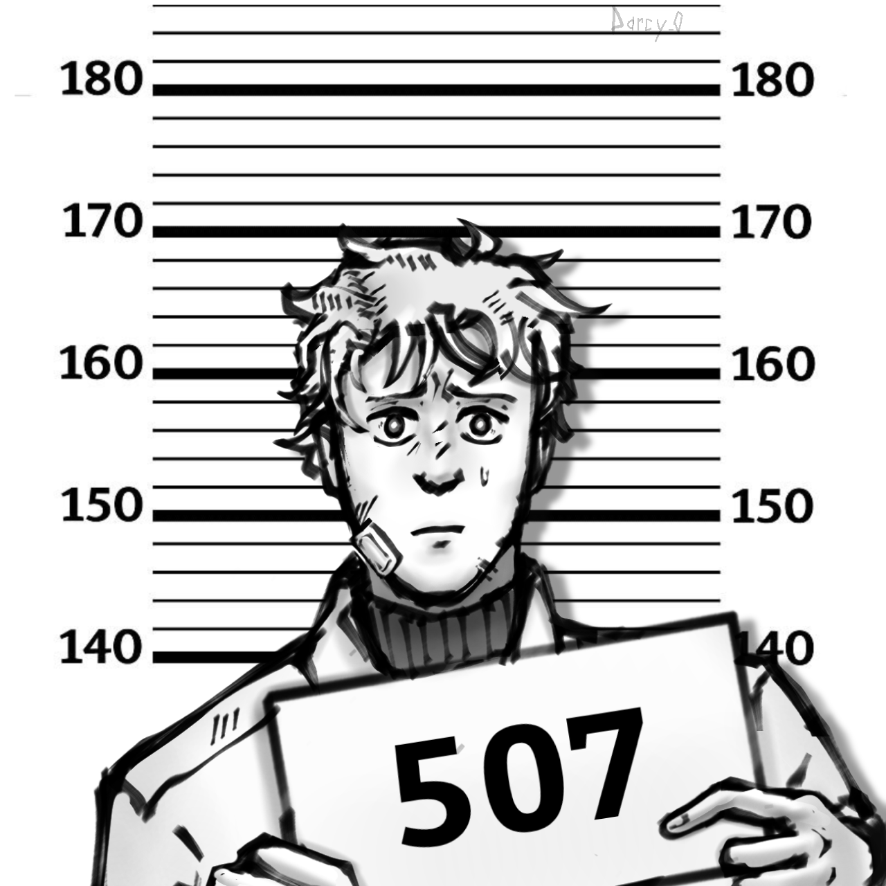

# 👤 Персонажи


Спасибо Darcy\_0 и Icomdir за дизайн персонажей!


<figure><figcaption>
Менеджер Зоны Содержания
</figcaption></figure>

 

<figure><figcaption>
Глава Службы Безопасности
</figcaption></figure>

 

<figure><figcaption>
Менеджер Комплекса
</figcaption></figure>

<figure><figcaption>
Крейн
</figcaption></figure>

 

<figure><figcaption>
Кевин
</figcaption></figure>

<figure><figcaption>
SCP-914-1
</figcaption></figure>

 

<figure><figcaption>
SCP-914-2
</figcaption></figure>

 

<figure><figcaption>
SCP-914-3
</figcaption></figure>

 

<figure><figcaption>
SCP-076
</figcaption></figure>

<figure><figcaption>
Концепт Сотрудника МЕД-отделения
</figcaption></figure>

<figure><figcaption>
SCP-507
</figcaption></figure>

 

<figure><figcaption>
Концепт SCP-507
</figcaption></figure>

